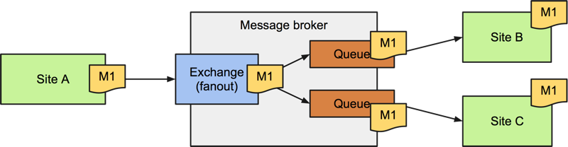

Introduction
============

In this example, we implement a simple publish-subscribe -scenario for Plone
with an
`AMQP <http://en.wikipedia.org/wiki/Advanced_Message_Queuing_Protocol>`_
message broker like `RabbitMQ <http://www.rabbitmq.com/>`_:

Setup
=====

Let there be a Plone site called **Site A**::

    git checkout https://github.com/datakurre/pubsubannouncements.git Site_A
    cd Site_A

    python bootstrap
    bin/buildout

    source bin/rabbitmq-env
    bin/rabbitmq-server

    bin/instance fg

This **Site A** has a view called ``@@send-announcement`` with a custom HTML
form for sending or clearing the announcement that should be shown also on all
the other site.

Then, let there be other Plone sites, and let's call one of them **Site B**::

    git checkout https://github.com/datakurre/pubsubannouncements.git Site_B
    cd Site_B

    python bootstrap
    bin/buildout instance:http-address=8081

    bin/instance fg

Those sites should immediately act upon on the announcement messages sent by
**Site A**. In this case by making those announcements visible for all the
current users.

Scenarios
=========

When we have at least one (and preferrebly at least the two) Plone instance
up and running, we still need to log in to each of them and create the actual
Plone site. For this example, we should always use ``Plone`` as the site id.

Finally, we should be able to try this out.

.. robot_tests::
   :source: ../src/pubsubannouncements/tests/test_announcement.txt

Scenario Steps Explained
========================

.. robot_keywords::
   :source: ../src/pubsubannouncements/tests/test_announcement.txt

Common Steps Explained
======================

.. robot_keywords::
   :source: ../src/pubsubannouncements/tests/common.txt

Disclaimer
==========

This package is intended as a simple example on how to implement and test an
instant publish-subscribe -scenario between multiple Plone sites using
`collective.zamqp <https://github.com/datakurre/collective.zamqp>`_.

This package is not intended to be used in production as such.
